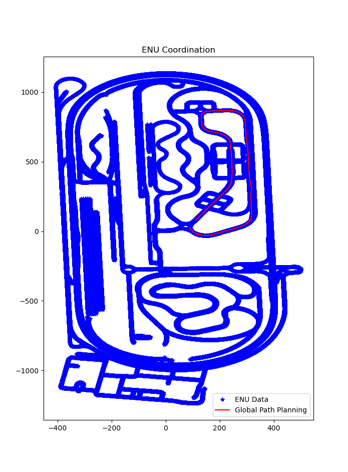

# Decision Algorithm for Autonomous Vehicle

---
## [Temporary Drive's License]

## Team

---
|     Image              |     Role      |      Name      |     email   |
|------------------------|---------------|----------------|-------------|
| |__Lead__|Sang-Hoon Ahn|22171365@inha.edu|
| | - |Min-Su Kang|ziz1945@naver.com|
| | - |Dong-Hyuk Park|qkrehdgursla@gmail.com|
| | - |Dong-Joo Lee|djkang1ee@naver.com|
| | - |Jae-Un Lee|moc06207@naver.com|

### Introduction
__Sang-Hoon Ahn:__ The Ph.D. student. Interest in Control, Communication(CAN, UDP, TCP/IP..etc) and Autonomous Driving.

__Min-Su Kang:__ The master's course student. Interest in Digital Twin, Localization, Decision and Autonomous Driving.

__Dong-Hyuk Park:__ The master's course student. Interest in Machine Learning, Control and Autonomous Driving.

__Dong-Joo Lee:__ The master's course student. Interest in Machine Learning, Perception(LiDAR) and Autonomous Driving.

__Jae-Un Lee:__ The master's course student. Interest in Machine Learning, Perception(Camera) and Autonomous Driving.

## Overview

---
2021년, 인하대학교 자율항법 연구실 소속 강민수 연구원의 판단 알고리즘 입니다.

이 알고리즘의 경우, 먼저 저희 연구실에서 보유하고 있는 차량의 자율주행 시스템 개발과 임시 운전 면허 취득을 위해 설계되었습니다.

간략하게 소개해 드리자면, 차량에서 생성되는 Velocity 및 GPS Data, 방향 지시등의 데이터를 CAN 통신으로 실시간 입력 받아 사용됩니다.
이는 [Kvaser](https://www.kvaser.com/) 에서 제공하는 CAN & CAN FD를 활용하였습니다. 또한, 출력되는 데이터도 마찬가지로 CAN 통신으로 진행됩니다. (Bitrate: 500kbps)

## HD Map

---

판단 알고리즘을 설계함에 앞서 저희는 HD Map을 활용하였습니다. Map 제공은 [국토지리정보원](https://www.ngii.go.kr/kor/main.do) 에서 제공 받을 수 있으며, [dbf, prj, dbn, sbx, shp] 등의 파일 형식으로 저장된다.
개발에 사용하고자 하는 지도 포맷인 osm 파일로 변환하기 위해, [JOSM](https://josm.openstreetmap.de/wiki/Download) 을 이용하여 shp를 osm으로 변환하였다.
하지만 기본적으로 JOSM은 shp 파일을 지원하지 않기 때문에, 플러그인 설치로 해결한다. 방법은 (Open JOSM -> Edit -> Preferences -> Plugins -> Search에 'opendata'를 입력하여 설치) 로 진행하며,
shp를 open하고 File -> Save As 버튼을 눌러 osm으로 변환 저장한다.

## Global Path Planning

---

Global Path Planning은 Python Code로 진행되었으며, [Pyroutelib3](https://github.com/MKuranowski/pyroutelib3) Library를 활용하여 진행되었다. 또한 DGIST ARTIV Lab.의 [Let's Do Global Path Planning!](https://dgist-artiv.github.io/hdmap/2021/02/15/artiv-pyroutelib3.html)
을 참고하여 Path Planning을 진행하였다.

## Local Path Planning

---

Local Path Planning은 Frenet Frame과 Jerk Minimization을 활용한 [Trajectory Planning in the Frenet Space](https://fjp.at/posts/optimal-frenet/) 을 참조하여 개발되었다. 

## Detecting Stop Line

---

신호등을 인지하고 난 뒤, 정지 신호에 맞추어 차량을 정지시키기 위해 마찬가지로 Stop Line이 있는 HD Map을 활용하였다. 이는 A2_LINK(모든 주행 노드가 있는 HD Map) 파일이 아닌 A2_STOP(신호등 정지선 노드가 있는 HD Map)을 기반으로 진행된 것이다.
정지선 추출 방법은 먼저

1. 정지 좌표의 모든 데이터를 입력 받는다.
2. 현재 Local Path Planning 알고리즘으로 생성된 path class의 x, y list 값을 불러온다.
3. 현재 나의 위치 path.x[0], path.y[0]과 x, y의 중심 값(path.x[int(len(path.x) / 2)], path.y[int(len(path.y) / 2)])을 가져온다. 이는 Local Path Planning으로 생성된 ROI 영역에서 Stop Line을 검출하기 위한 TTC 존을 임의로 설정한 영역이다.
4. 위의 두 x, y 좌표를 서로 비교하여 Heading 값을 추출하기 위해 arctan 공식을 활용한다.
5. 이후, 내 좌표와 다른 정지 좌표를 서로 비교하여 Heading 값을 추출하기 위해 이 또한 arctan 공식을 활용한다.
6. 이로써 출력된 모든 정지 좌표의 Heading은 현재 나의 Heading을 기반으로 코사인 유사도 방식을 사용하고, 설정된 Threshold 내에 있다면 그 좌표와 내 좌표에 대한 유클라디안 거리(상대 거리)를 생성하여 저장한다.
7. 저장된 거리에서 최소의 거리를 가진 좌표를 검출하여 전방의 정지 좌표를 Detecting 한다.

이와 같은 방식으로 정지 좌표가 검출된다.

## Turn Signal

---
이는 임시 운행을 위한 영역으로, 운전자가 수동으로 방향 지시등을 사용했을 때, 그 정보를 받아 그에 따른 Local Path Planning된 정보를 업데이트 하여 주는 단계이다.

방향 지시등은 먼저 운전자가 스틱을 움직였을 때 깜빡이면서 동작하는데, 데이터는 1과 0이 반복되면서 수신된다. 이는 1일 때 방향 지시등 ON, 0일 때 OFF를 뜻한다.

설계한 동작 조건은 간단하다. Local Path Planning의 Frenet Frame Trajectory 알고리즘을 최대한 활용하였다. 방향 지시등을 인가 받았을 때, 1을 한번만 받을 수 있도록 진행된다. 이는 깜빡이는 것을 이벤트로 주지 않고, 시간 단위로 이벤트를 주기 위함이다.

깜빡이는 신호가 생성됨과 동시에 start_time이 reset되며, end_time과 비교하여 1~2초가 지난 뒤, 전방에 하나의 obstacle을 생성하여 이를 회피하는 Trajectory로 구현되어 있다. 또한, 왼쪽 및 오른쪽으로 Trajectory로 변경한 뒤,
바뀐 차선으로 계속 주행시키기 위해 전역변수로 설정된 'MAX_LEFT_WIDTH'와 'MAX_LEFT_WIDTH'이 변경된다. 이 Parameter는 'temp_light' 변수에 따라 변경된다.

## Output

---
Global Path Planning은 한번 동작하며, Local Path Planning은 상시 동작한다. 이 과정에서 출력되는 데이터는 제어 시스템에 전달하기 위한 위도, 경도, 고도 및 정지 좌표의 위도, 경도이다.

제어 시스템에 주기 위한 다음 좌표 (위도, 경도)는 속도를 기반으로 Lookahead에 맞추어 좌표를 추출하여 송신한다. 마찬가지로 정지 좌표는 상시 전달된다.

## 참고사항

---
먼저 이 코드를 사용하기 위한 HD Map은 법령에 따라 배포가 금지되어 있으며, CAN DBC 또한 내부 규제로 인해 배포가 금지된다. 