# Decision Algorithm for Autonomous Vehicle

---
## [Temporary Drive's License]

## Team

---
|     Image              |     Role      |      Name      |     email   |
|------------------------|---------------|----------------|-------------|
| |__Lead__, __H/W__, __Communication__|Sang-Hoon Ahn|22171365@inha.edu|
| | __Decision__ |Min-Su Kang|ziz1945@naver.com|
| | __Control__ |Dong-Hyuk Park|qkrehdgursla@gmail.com|
| | __Perception (Lidar)__ |Dong-Joo Lee|djkang1ee@naver.com|
| | __Perception (Camera)__ |Jae-Un Lee|moc06207@naver.com|

### Introduction
__Sang-Hoon Ahn:__ The Ph.D. student. Interest in Control, Communication(CAN, UDP, TCP/IP..etc) and Autonomous Driving.

__Min-Su Kang:__ The master's course student. Interest in Digital Twin, Localization, Decision and Autonomous Driving.

__Dong-Hyuk Park:__ The master's course student. Interest in Machine Learning, Control and Autonomous Driving.

__Dong-Joo Lee:__ The master's course student. Interest in Machine Learning, Perception(LiDAR) and Autonomous Driving.

__Jae-Un Lee:__ The master's course student. Interest in Machine Learning, Perception(Camera) and Autonomous Driving.


## Overview

---
2021년, 인하대학교 자율항법 연구실 소속 강민수 연구원의 판단 알고리즘 입니다.

이 알고리즘의 경우, 먼저 저희 연구실에서 보유하고 있는 차량의 자율주행 시스템 개발과 임시 운전 면허 취득을 위해 설계되었습니다.

간략하게 소개해 드리자면, 차량에서 생성되는 Velocity 및 GPS Data, 방향 지시등의 데이터를 CAN 통신으로 실시간 입력 받아 사용됩니다.
이는 [Kvaser](https://www.kvaser.com/) 에서 제공하는 CAN & CAN FD를 활용하였습니다. 또한, 출력되는 데이터도 마찬가지로 CAN 통신으로 진행됩니다. (Bitrate: 500kbps)

## HD Map Conversion

---
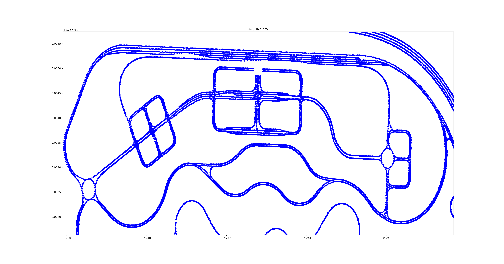

판단 알고리즘을 설계함에 앞서 저희는 HD Map을 활용하였습니다. Map 제공은 [국토지리정보원](https://www.ngii.go.kr/kor/main.do) 에서 제공 받을 수 있으며, [dbf, prj, dbn, sbx, shp] 등의 파일 형식으로 저장된다.
개발에 사용하고자 하는 지도 포맷인 osm 파일로 변환하기 위해, [JOSM](https://josm.openstreetmap.de/wiki/Download) 을 이용하여 shp를 osm으로 변환한다.
기본적으로 JOSM은 shp 파일을 지원하지 않기 때문에, 플러그인 설치로 해결한다. 방법은 (Open JOSM -> Edit -> Preferences -> Plugins -> Search에 'opendata'를 입력하여 설치) 로 진행하며,
shp를 open하고 File -> Save As 버튼을 눌러 osm으로 변환 저장한다.

## Global Path Planning

---
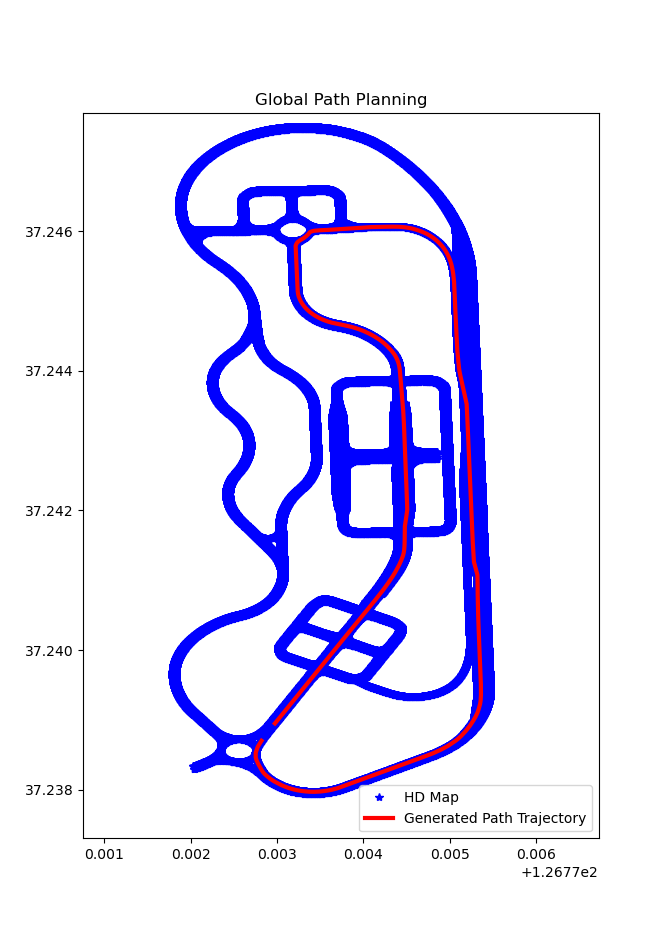

#### Global Path Planning은 Python Code로 진행되었으며, [Pyroutelib3](https://github.com/MKuranowski/pyroutelib3) Library를 활용하여 진행되었다. 또한 DGIST ARTIV Lab.의 [Let's Do Global Path Planning!](https://dgist-artiv.github.io/hdmap/2021/02/15/artiv-pyroutelib3.html) 을 참고하여 Path Planning을 진행하였다.

## 사전 작업 (HD Map)

### [AS - IS]
pyroutelib3을 그대로 사용하였을 경우 역주행 경로가 생성될 수 있으며, node간 연결이 되어있지 않은 경우 차선 변경을 할 수 없다.
1. 역주행 원인: 단순하게 현재 node와 연결된 다른 node를 탐색하여 계산하는 logic
2. 차선 변경x 원인: node와 node 사이가 직접 연결되어 있지 않으면 이동할 수 없는 곳으로 간주함

### [TO - BE]
#### 1. 차로 변경할 수 있는 way를 만들어야 한다.

먼저 차선 정보가 들어가 있는 B2_SURFACELINEMARK.osm은, ‘Type’이라는 tag로 차선 형태를 구별한다. 차로 변경이 가능한 경우는 백색 점선, 백색 좌점 혼선(겹선의 형태로, 왼쪽은 점선 오른쪽은 실선), 백색 우점 혼선(겹선의 형태로, 왼쪽은 실선 오른쪽은 점선)인 경우이다. 편도 1차로 도로에서 중앙선을 넘어 추월을 허용하는 황색 점선 등은 포함하지 않는다. 차선이 백색 점선인 경우 왼쪽->오른쪽, 오른쪽->왼쪽으로 차선 변경이 가능하지만, 좌점 혼선이나 우점 혼선의 경우에는 한쪽 방향으로만 차선 변경이 가능하다.

#### 2. 주행 유도선 파일과 차선 파일을 파싱한다.

위에서 말한 3가지 타입의 차로 변경 가능 구역을 별도의 list로 만든다.

left_change = [] #왼쪽으로만 차선 변경이 가능할 경우 right to left

right_change = [] #오른쪽으로만 차선 변경이 가능할 경우 left to right

both_change = [] #양쪽으로 차선 변경이 가능할 경우

이 list에는 'L_LINKID'와 'R_LINKID' 정보가 tuple 형태로 들어간다. 'L_LINKID'는 차선 왼쪽에 위치한 주행유도선의 ID를 나타내는 tag이고, 'R_LINKID'는 차선 오른쪽에 위치한 주행유도선의 ID를 나타내는 tag이다. 각 LINKID를 통해 주행유도선 정보를 얻을 수 있는 것이다.

#### 3. 정한 규정에 맞춰 차로 변경 구간을 계산한다.
* #### 최소 차로 변경 거리 규정: 
  
차로 변경을 너무 짧은 거리 내에서 이루어지게 하면 차량 주행 시 안전에 문제가 있기 때문에, 최소 차로 변경 길이는 20m로 지정하였다. 이는 사용자가 수정할 수 있으며 20m는 실험에 의해 측정된 결과값을 기반한다. 즉 노드를 기준으로 20개 노드가 떨어져야만 차로 변경 way가 생성되도록 구성하였다.

* #### Way의 시작점에서 차로 변경 금지: 
  
주행 유도선의 way는 주행 경로 노드가 포함된 A1_NODE.osm에 의해 구분된다. 주행 경로 노드는 정지선, 진/출입시점, 회전 발생 시점, 터널, 교량 등 도로 속성에 어떤 변화가 생길 때 만들어져 있는데, 이런 지점에서 차선 변경을 시도하는 것은 불확실한 위험성이 존재한다고 판단하였다. 이에 따라 way가 시작하는 시점에서는 차로 변경을 하지 못하도록, 차로 변경 시점을 10번 index로 지정한다. 1m 간격으로 node를 세분화하였을 경우, way가 시작한지 약 10m 지점에서부터 차로 변경을 허용한다.

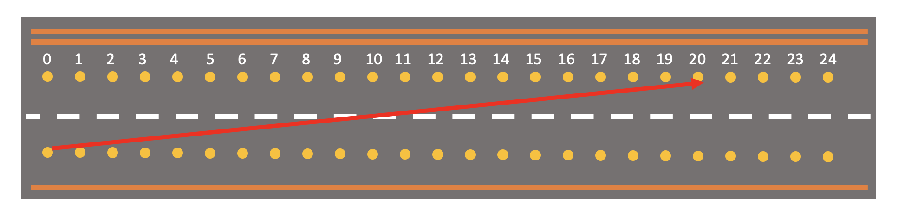

#### 4. 차로 변경 Way 형성.

위 규칙들을 만족할 때 시점의 node ID와 종점의 node ID를 이용하여 새로운 way를 형성한다. 이 way에 들어가는 tag는 아래와 같다.

```
{'Maker' : 'ARTIV_osm_formatter',
 'LinkType' : 'lane_change',
 'highway' : 'ARTIV_lane_change'}
```
어떤 용도로 어떻게 만들었는지 알기 위해 'Maker'와 'LinkType' tag를 추가하고, pyroutelib3를 이용하여 path planning을 수행할 때 차로 변경 way에는 가중치를 다르게 줄 수 있도록 'highway' : 'ARTIV_lane_change'를 추가한다. 차로 변경 way의 weight이 일반 주행유도선과 동일하여 불필요한 차로 변경을 유발하지 않게 하기 위함이다.

### Results

ARTIV_osm_formatter를 실행시킨 최종 결과는 위와 같다. 왼쪽은 원본 A2_LINK.osm파일이고, 오른쪽은 output파일이다. 노드가 촘촘해지고, 차로 변경 way가 추가되었음을 알 수 있다.

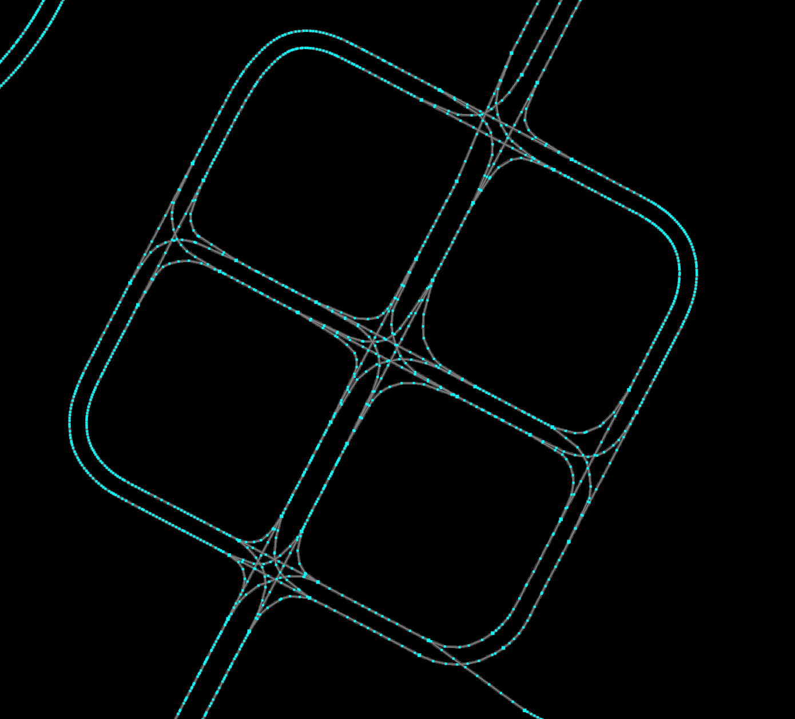 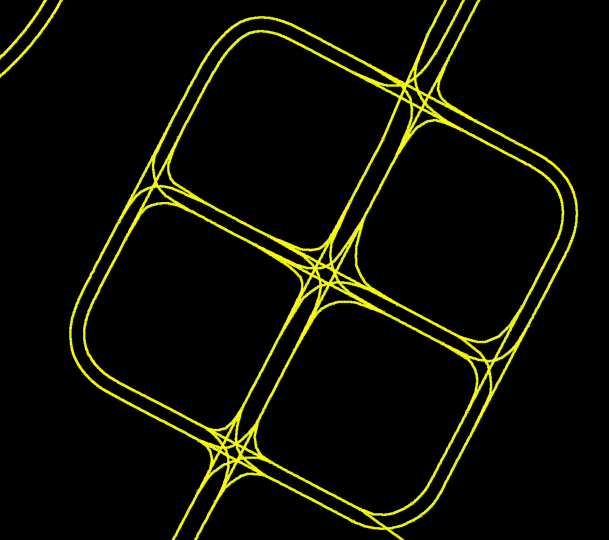


### Usage

파일에 첨부되어 있는 main.py와 OSMHandler.py는 ARTIV | DGIST Lab. 의 github에서 다운받은 것이며, 실행 방법은 먼저
1. 같은 경로 내에 A2_LINK.osm, B2_SURFACELINEMARK.osm 가 있어야 한다.
2. 주소 창에 'cmd'를 입력한 뒤, 하단 command를 입력한다.
```
python main.py -f A2_LINK.osm B2_SURFACELINEMARK.osm A2_LINK_output.osm -o 0.3 30
```
A2_LINK_output.osm 은 결과 값이 담긴 파일을 생성하는 이름이며, "-o 0.3" 은 Node interval로 0.3m를 나타낸다. 또한 "30" 은 Lane Change node를 나타낸다.

## 사전 작업 (Pyroutelib)

위와 같이 Pyroutelib3을 기반으로 Global Path Planning을 수행하기 위해, pyroutelib3의 .py 파일 또한 수정을 하여야 한다.

### types.py

pyroutelib3의 types.py의 car에 설정된 weights를 아래와 같이 수정한다. 이는 pyroutelib3 내부의 A* 알고리즘을 사용하기 위함이다.
```
"weights": {
    "motorway": 10, "trunk": 10, "primary": 2, "secondary": 1.5, "tertiary": 1,
    "unclassified": 1, "residential": 0.7, "living_street": 0.5, "track": 0.5,
    "service": 0.5, "ARTIV_lane_change": 0.5,
}
```

### datastore.py

pyroutelib3에서 역주행 경로를 형성하는 이유는, way의 방향성을 무시하고 단순히 한 node에 연결된 다른 node들을 모두 갈 수 있는 node로 취급하기 때문이다. 그 이유는 모든 way가 양방향으로 주행할 수 있는 경로라고 생각하기 때문인데, 처음에는 datastore.py에서 무조건 way의 방향성을 따라서만 cost를 지정하도록 수정한다.
```
#Calculate cost of this edge
cost = self.distance(node1Pos, node2Pos) / weight
self.routing.setdefault(node1Id, {})[node2Id] = cost

'''
# Is the way traversible forward?
if oneway >= 0:
    self.routing.setdefault(node1Id, {})[node2Id] = cost
# Is the way traversible backwards?
if oneway <= 0:
    self.routing.setdefault(node2Id, {})[node1Id] = cost
'''
```
기존에는 oneway의 여부에 따라 cost를 한쪽으로만 저장하거나 양방향 모두를 저장하는데, 현재 생성된 HD Map 상에서의 way는 모두 단방향 주행만 가능하므로, way의 방향대로만 cost를 저장하도록 수정한다.

### osmparsing.py

oneway tag에 따라 방향을 설정해준다.
```
def getWayOneway(way: dict, profile_name: str) -> int:
    """Checks in which direction can this way be traversed.
    For on-foot profiles only "oneway:foot" tags are checked.

    Returns:
    - -1 if way can only be traversed backwards,
    -  0 if way can be traversed both ways,
    -  1 if way can only be traversed forwards.
    """
    oneway = 0

    # on-foot special case
    if profile_name == "foot":
        oneway_val = way["tag"].get("oneway:foot", "")
        if oneway_val in {"yes", "true", "1"}:
            oneway = 1
        elif oneway_val in {"-1", "reverse"}:
            oneway = -1

        return oneway

    # Values used to determine if road is one-way
    oneway_val = way["tag"].get("oneway", "")
    highway_val = way["tag"].get("highway", "")
    junction_val = way["tag"].get("junction", "")

    # Motorways are one-way by default
    if highway_val in {"motorway", "motorway_link"}:
        oneway = 1

    # Roundabouts and circular junctions are one-way by default
    if junction_val in {"roundabout", "circular"}:
        oneway = 1

    # oneway tag present
    if "oneway" in way["tag"]:
        value = way["tag"]["oneway"]
        if value in {"yes", "true", "1"}:
            oneway = 1
        elif value in {"-1", "reverse"}:
            oneway = -1
        elif value in {"no"}:
            oneway = 0

    return oneway
```

## Global Path Planning 실행

Pyroutelib3의 Router Class parameter를 생성하여 위와 같이 생성된 osm 파일을 불러온다.
```
router = Router("car", "A2_LINK_OUT.osm") # Router(transport modes, file name)
```
* transport modes는 총 6가지(car, cycle, foot, horse, tram, train)가 있으며, 설정되는 transport mode을 기반으로 osm 파일 내에 있는 좌표 데이터를 추출한다.
* Osm 파일은 좌표 데이터(way) 및 그 좌표에 대한 transport mode, next route 등이 설정되어 있다. 하단은 way에 대한 information을 나타낸다.

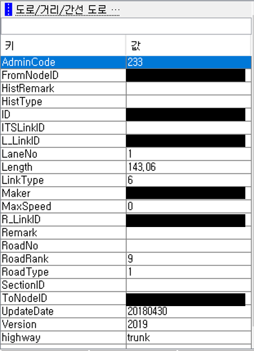

불러온 총 좌표 데이터를 바탕으로 Global Path Planning을 시작하기 위해, 시작점과 도착점을 설정한다.
```
start = router.findNode(lat, lon) # 나의 좌표
end = router.findNode(37.1111111, 126.11111111) # 목표 지점 좌표
```
* Start: 이는 현재의 latitude, longitude를 나타내며, CAN 통신으로 반환한 데이터를 findNode 함수에 인가한다.
* End: 이는 도착점을 나타내며, 지정한 내용으로 위와 같이 latitude, longitude를 설정한다.

설정된 start, end좌표와 추출된 좌표를 바탕으로 pyroutelib3 내부의 A* 알고리즘을 활용하여 최종 Status(상태)와 route(최단 경로)를 반환한다.
```
status, route = router.doRoute(start, end)
```
* Status: A* 알고리즘을 사용하여 경로가 생성되었는지 여부를 판단하는 Parameter로 (success, no_route, gave_up)이 있다. ‘success’면 경로 계획 성공, 그 외에는 경로 계획 실패.
* route: start와 end 좌표를 기반으로 생성된 최단 경로로 배열로 이루어져 있다.

만약 status -> 'success' 가 될 경우, 계획된 경로를 2차원 배열로 반환하기 위해 위의 코드와 같이 진행한다.
```
    if status == 'success':
        routeLatLons = list(map(router.nodeLatLon, route))  # Get actual route coordinates
        routeLatLons = np.array(routeLatLons)

        # Essential (Change list)
        result_path = []
        for latlon in routeLatLons:
            result_path.append([float(latlon[0]), float(latlon[1])])
        result_path = np.array(result_path)
```

이후 계산된 결과 값을 확인하기 위해 Plotting을 해보면 하단의 그림과 같이 결과가 도출된다.

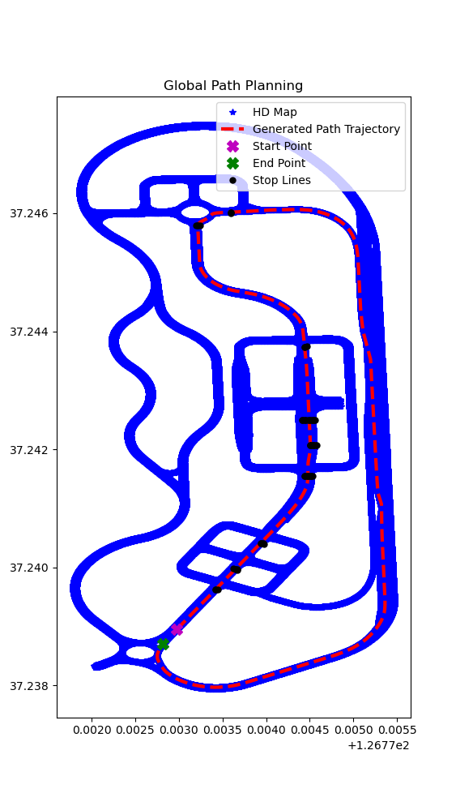

#### 참조: [ARTIV_OSM_FORMATTER](https://dgist-artiv.github.io/hdmap/2021/02/09/artiv-osm-formatter-part2.html), [Github](https://github.com/js-ryu/for_ARTIV_Framework/tree/main/artiv_osm_formatter)
## Local Path Planning

---
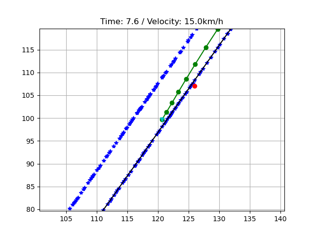 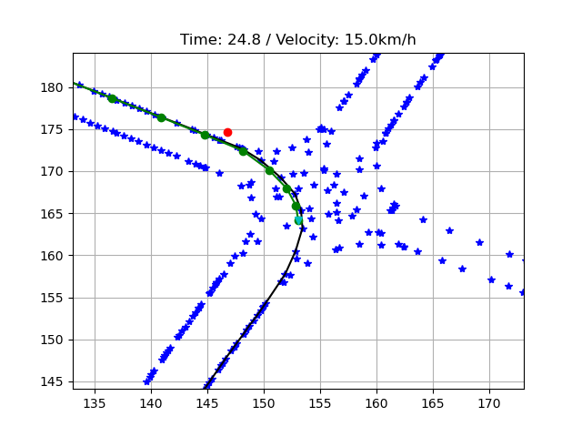

Local Path Planning은 Frenet Frame과 Jerk Minimization을 활용한 [Trajectory Planning in the Frenet Space](https://fjp.at/posts/optimal-frenet/) 을 참조하여 개발되었다. 

### Initialize

Global Path Planning으로 인해 생성된 최단 경로를 기반으로 차량이 종방향 및 횡방향을 순조롭게 진행하도록 하단의 함수를 실행한다. 이는 Cubic Spline Curvature를 사용하는 Cubic Spline Planner를 사용하며, x, y, curvature, yaw, 총 좌표에 대한 index를 반환한다.
Local Path Planning (Frenet Frame Algorithm)을 사용하기에 앞서 lateral position, speed, acceleration을 초기에 0으로 설정한다. 
```
dx, dy, dyaw, dk, s = get_course(result_path[:, 0], result_path[:, 1]) # X, Y Yaw, Curvature, Index
```
```
c_d = 0.0  # current lateral position [m]
c_d_d = 0.0  # current lateral speed [m/s]
c_d_dd = 0.0  # current lateral acceleration [m/s]
```
### Implementation

현재 위치를 CAN으로 수신받는 실시간 환경에서, 현재 위치를 바탕으로 최소 Euclidean distance를 가진 index를 's' parameter를 통해 반환한다.
그리고 아래의 함수를 통해 Frenet Optimal Trajectory Algorithm을 실행시킨다.
```
path = frenet_optimal_planning(s, s0, velocity.value, c_d, c_d_d, c_d_dd, obstacle)
```
path class parameter가 상시 업데이트 되는 상황에서, path에 있는 데이터를 기반으로 기존의 lateral position, speed, acceleration을 상시 업데이트 한다.
```
c_d = path.d[1]
c_d_d = path.d_d[1]
c_d_dd = path.d_dd[1]
```

또한 전역변수로 MAX_SPEED, MAX_ACCEL, MAX_CURVATURE 등이 설정되어 있으며, check_collision 함수를 통해 전방에 있는 obstacle을 감지하여 그 후의 Local Path Planning을 수행한다. 만약 주행 중 Speed, Acceleration, Curvature가 기존 전역 변수보다 높으면 아래와 같이 Warning 신호를 주며, Obstacle 또한 TTC Zone에 들어올 경우 Warning 신호를 생성한다.
```
if Out_of_speed == True:
    print("[Speed] -> Out of the Max")
    Out_of_speed = False

if Out_of_accel == True:
    print("[Accel] -> Out of the Max")
    Out_of_accel = False

if Out_of_curvature == True:
    print("[Curvature] -> Out of the Max")
    Out_of_curvature = False

if Warning_obstacle == True:
    print("[WARNING] -> Obstacle")
    Warning_obstacle = False
```

그리고 입력되는 velocity를 바탕으로 자동차 제동 거리 공식을 활용하여, 현재 지점과 목표 지점의 차이가 자동차 제동 거리보다 작다면 Local Path Planning Loop를 빠져나오도록 설계하였다.
```
break_distance = round(0.0005 * math.pow(velocity.value * 3.6, 2) + 0.2 * (velocity * 3.6), 3)
comp_end = np.hypot(path.x[1] - dx[-1], path.y[1] - dy[-1])
# 자동차 제동 거리와 비교해서 다달으면 모든 코드 break
if comp_end <= break_distance:
    print("Goal!")
    ALL_STOP.value = 1
    break
```
결론적으로 Local Path Planning을 하기 위해 Frenet Frame Optimal Trajectory 알고리즘을 활용하였으며, 상시 입력되는 데이터는 현재 차량의 좌표 및 속도, 인지 센서로부터 수신되는 장애물 좌표를 기반으로 다음 지점에 대한 좌표를 출력한다.
다음 좌표는 현재 속도를 바탕으로 Lookahead를 계산하고 현재 좌표와의 거리를 비교하여 가장 거리가 비슷한 거리의 좌표를 반환한다.
```
lookahead = velocity.value * 0.2 + 4.5
num = 0
for i in range(len(path.x)):
    distance = np.hypot(path.x[i] - path.x[0], path.y[i] - path.y[0])
    dists = distance - lookahead
    if dists > 0:
        num = i
        break
next_lat, next_lon, next_alt = pm.enu2geodetic(path.x[num], path.y[num], center[2], center[0], center[1], center[2]) #ENU to LLH
```
아래의 왼쪽 그림은 주행 중 전방에 Obstacle을 회피하는 과정을 나타낸 것이며, 우측은 각 Obstacle을 회피하여 주행한 궤적의 결과를 나타낸다.

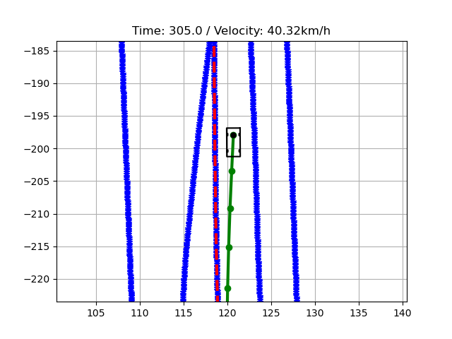 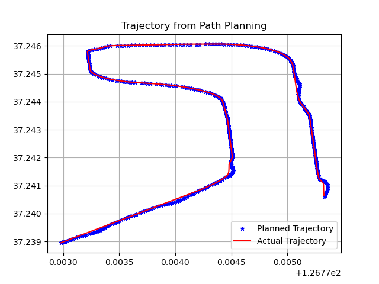

#### 참조: [Trajectory Planning in the Frenet Space](https://fjp.at/posts/optimal-frenet/), [PythonRobotics](https://github.com/AtsushiSakai/PythonRobotics)

## Detecting Stop Line

---
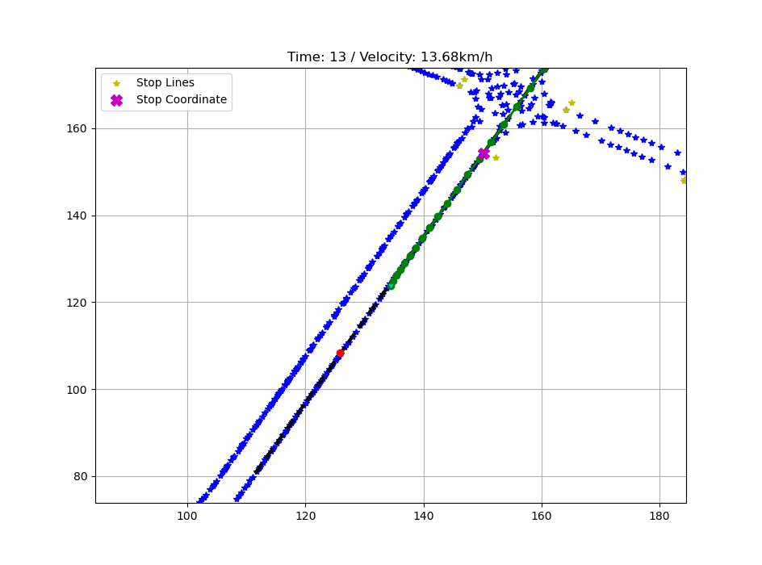

신호등을 인지하고 난 뒤, 정지 신호에 맞추어 차량을 정지시키기 위해 마찬가지로 Stop Line이 있는 HD Map을 활용하였다. 이는 A2_LINK(모든 주행 노드가 있는 HD Map) 파일이 아닌 A2_STOP(신호등 정지선 노드가 있는 HD Map)을 기반으로 진행된 것이다.
정지선 추출 방법은 먼저

1. 정지 좌표의 모든 데이터를 입력 받는다.
2. 현재 Local Path Planning 알고리즘으로 생성된 path class의 x, y list 값을 불러온다.
3. 현재 나의 위치 path.x[0], path.y[0]과 x, y의 중심 값(path.x[int(len(path.x) / 2)], path.y[int(len(path.y) / 2)])을 가져온다. 이는 Local Path Planning으로 생성된 ROI 영역에서 Stop Line을 검출하기 위한 TTC 존을 임의로 설정한 영역이다.
4. 위의 두 x, y 좌표를 서로 비교하여 Heading 값을 추출하기 위해 arctan 공식을 활용한다.
5. 이후, 내 좌표와 다른 정지 좌표를 서로 비교하여 Heading 값을 추출하기 위해 이 또한 arctan 공식을 활용한다.
6. 이로써 출력된 모든 정지 좌표의 Heading은 현재 나의 Heading을 기반으로 코사인 유사도 방식을 사용하고, 설정된 Threshold 내에 있다면 그 좌표와 내 좌표에 대한 유클라디안 거리(상대 거리)를 생성하여 저장한다.
7. 저장된 거리에서 최소의 거리를 가진 좌표를 검출하여 전방의 정지 좌표를 Detecting 한다.

이와 같은 방식으로 정지 좌표가 검출된다.

## Turn Signal

---
이는 임시 운행을 위한 영역으로, 운전자가 수동으로 방향 지시등을 사용했을 때, 그 정보를 받아 그에 따른 Local Path Planning된 정보를 업데이트 하여 주는 단계이다.

방향 지시등은 먼저 운전자가 스틱을 움직였을 때 깜빡이면서 동작하는데, 데이터는 1과 0이 반복되면서 수신된다. 이는 1일 때 방향 지시등 ON, 0일 때 OFF를 뜻한다.

설계한 동작 조건은 간단하다. Local Path Planning의 Frenet Frame Trajectory 알고리즘을 최대한 활용하였다. 방향 지시등을 인가 받았을 때, 1을 한번만 받을 수 있도록 진행된다. 이는 깜빡이는 것을 이벤트로 주지 않고, 시간 단위로 이벤트를 주기 위함이다.

깜빡이는 신호가 생성됨과 동시에 start_time이 reset되며, end_time과 비교하여 1~2초가 지난 뒤, 전방에 하나의 obstacle을 생성하여 이를 회피하는 Trajectory로 구현되어 있다. 또한, 왼쪽 및 오른쪽으로 Trajectory로 변경한 뒤,
바뀐 차선으로 계속 주행시키기 위해 전역변수로 설정된 'MAX_LEFT_WIDTH'와 'MAX_LEFT_WIDTH'이 변경된다. 이 Parameter는 'temp_light' 변수에 따라 변경된다.

하단의 왼쪽 그림은 Turn Right Signal을 받았을 경우, 오른쪽 그림은 Turn Left Signal을 받았을 경우를 나타낸 그림이다.

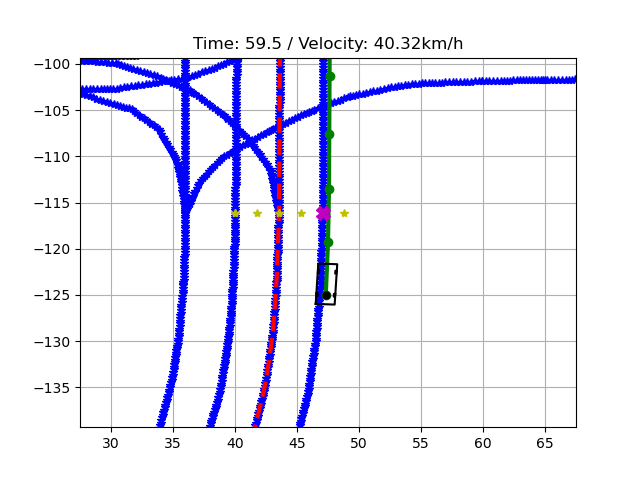 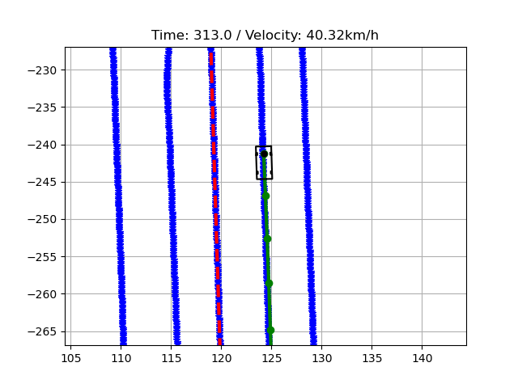

## Output

---
Global Path Planning은 한번 동작하며, Local Path Planning은 상시 동작한다. 이 과정에서 출력되는 데이터는 제어 시스템에 전달하기 위한 위도, 경도, 고도 및 정지 좌표의 위도, 경도이다.

제어 시스템에 주기 위한 다음 좌표 (위도, 경도)는 속도를 기반으로 Lookahead에 맞추어 좌표를 추출하여 송신한다. 마찬가지로 정지 좌표는 상시 전달된다.


## 참고사항

---
먼저 이 코드를 사용하기 위한 HD Map은 법령에 따라 배포가 금지되어 있으며, CAN DBC 또한 내부 규제로 인해 배포가 금지된다. 
